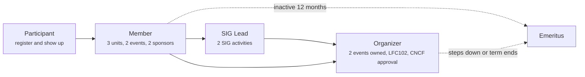

# Cloud Native Karachi Community

Governance and membership for [Cloud Native Karachi](https://cloud-native-karachi.github.io), a CNCF Cloud Native Community Group.

This repository is the register of record. Roles belong to people listed in files here, changes happen by pull request, and git history is the audit trail.

The website is in [cloud-native-karachi.github.io](https://github.com/cloud-native-karachi/cloud-native-karachi.github.io). Registration and attendance live on our [group page](https://ocgroups.dev/cncf/group/cn-khi), which is the CNCF's record, not this repository.

## Start here

To attend a meetup you do not need this repository. Register on the [group page](https://ocgroups.dev/cncf/group/cn-khi), join [WhatsApp](https://chat.whatsapp.com/EI1MMr0gbtM5t3h5yYErIH), turn up. That makes you a Participant, and it is a complete way to be part of the group.

Read on if you want to help run it.

## The ladder



| Role | Listed in | Who decides | Detail |
| --- | --- | --- | --- |
| Participant | Nowhere, no application | Nobody, it is open | [membership.md](governance/membership.md#participant) |
| Member | [members/members.yaml](members/members.yaml) | 2 sponsors, 1 organizer approves | [membership.md](governance/membership.md#member) |
| SIG Lead | The SIG's charter | Majority of organizers | [sigs.md](governance/sigs.md) |
| Organizer | [members/organizers.yaml](members/organizers.yaml) plus the CNCF group page | Organizers nominate, **CNCF appoints** | [organizers.md](governance/organizers.md) |
| Emeritus | [members/emeritus.yaml](members/emeritus.yaml) | Automatic or on request | [membership.md](governance/membership.md#inactivity-and-emeritus) |

Organizer is the only role the group cannot grant. See [the CNCF request](governance/organizers.md#step-4-the-cncf-request).

## Special Interest Groups

A SIG is a standing group with one topic, a charter, and something scheduled every quarter. It stays proposed until it has a lead and a date for its first activity, and only then is it announced as joinable.

[sigs/README.md](sigs/README.md) is the index and carries the topic, state and lead of each one. Rules and lifecycle: [governance/sigs.md](governance/sigs.md).

## How to do things

| I want to | Do this |
| --- | --- |
| Become a Member | Open a [membership request](https://github.com/cloud-native-karachi/community/issues/new?template=membership-request.yml) |
| Speak at a meetup | Open a [talk proposal](https://github.com/cloud-native-karachi/community/issues/new?template=talk-proposal.yml) |
| Start a SIG | [governance/sigs.md](governance/sigs.md), then a [SIG proposal](https://github.com/cloud-native-karachi/community/issues/new?template=sig-proposal.yml) |
| Nominate an organizer | [governance/organizers.md](governance/organizers.md) |
| Host or sponsor a meetup | [events/playbook.md](events/playbook.md) |
| Report a Code of Conduct concern | [CODE_OF_CONDUCT.md](CODE_OF_CONDUCT.md) |

## Repository map

```text
governance/     roles, criteria, decision making, moderation
members/        the register, validated in CI
sigs/           one directory per SIG, each with a charter
events/         running a meetup, selecting talks
scripts/        register validation
```

## Which rules are in force

Membership thresholds follow the `phase` field in [members.yaml](members/members.yaml). While it reads `founding`, the lower bar in [the founding phase](governance/membership.md#founding-phase) applies. That phase ends once the group has held 3 events and listed 10 Members, both of them, and `scripts/validate_members.py` prints the counts and the phase on every pull request.

Headcounts are not repeated in prose here. Who holds a role is whatever [organizers.yaml](members/organizers.yaml), [members.yaml](members/members.yaml) and [emeritus.yaml](members/emeritus.yaml) say, and registration and attendance stay on the [group page](https://ocgroups.dev/cncf/group/cn-khi).

## License

[CC BY 4.0](LICENSE) for documentation, Apache 2.0 for scripts.
