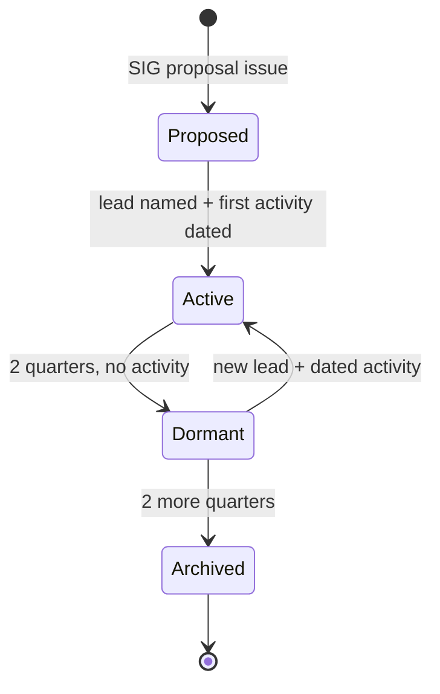

# Special Interest Groups

A SIG is a standing group with one topic, one or two leads, and something scheduled every quarter. SIGs let the group go deeper than a monthly meetup allows, and let people take real ownership without waiting for an organizer slot.

See [../sigs/README.md](../sigs/README.md) for the index and the state of each one.

A SIG is not a WhatsApp group with a name, a job title, or a way to reserve a topic. If nothing is scheduled it is not a SIG, and the lifecycle says so rather than leaving a dead entry in the index.

The quarterly cadence follows the CNCF's 90-day activity rule: a SIG that idles for a quarter consumes the group's activity budget without contributing to it.

## Lifecycle

| State | Means | Leaves when |
| --- | --- | --- |
| **Proposed** | Accepted, but no lead or no date. Listed as proposed, not announced as joinable, because there is nobody to join. | A lead is named and a first activity dated |
| **Active** | Announced, has a CODEOWNERS entry, and its lead can co-host events on the group page. | 2 consecutive quarters with no activity |
| **Dormant** | An organizer marks it. The lead role is vacated and the topic is open to someone else. Not a punishment; it keeps the index truthful. | A new lead dates an activity, or 2 more quarters pass |
| **Archived** | Directory moves under `sigs/archived/` with a closing note. Nothing is deleted. | A fresh proposal, which may cite the old charter |

Dormant and archived transitions need a majority of organizers and a 7-day comment period, same as creation.

## Proposing a SIG

Open a [SIG proposal](https://github.com/cloud-native-karachi/community/issues/new?template=sig-proposal.yml) with:

1. **Scope** in two or three sentences, including what is out of scope. "Cloud native" overlaps everything and will be sent back.
2. **Why an existing SIG does not cover it.** Overlap is the most common reason a proposal is sent back.
3. **A proposed lead** meeting the [SIG Lead criteria](membership.md#sig-lead), or "looking for one", which keeps it proposed.
4. **The first activity**, what and roughly when. "A Kyverno workshop, October 2026" is enough. "Regular meetups" is not.
5. **Three first-year topics**, which tests whether there is a year of material in the idea.
6. **Two people beyond the lead** who will show up and help. A SIG of one goes dormant in a quarter.

Majority of organizers after a 7-day comment period. On approval, add a directory with a charter based on an existing one, plus the CODEOWNERS entry.

## Charters

Every SIG has a `charter.md` stating scope, out of scope, leads, state, cadence and where it talks. Keep it short; a charter is a contract about scope, and a long one is usually hiding a vague one.

Changes need the lead's approval plus one organizer. A scope change wide enough to overlap another SIG needs the same threshold as a new SIG.

## Leads

Criteria are in [membership.md](membership.md#sig-lead). At most 2 leads per SIG, and a person leads at most 1 SIG.

A lead's job is that something happens every quarter, not being the topic expert. The best leads mostly recruit other speakers; one who delivers all four quarterly activities personally is building a dependency rather than a SIG.

## Where SIGs talk

`#cloud-native-karachi` and the contributors WhatsApp group, with a prefix in the subject. No channel per SIG at this size: three quiet channels read as a dead community, and splitting a group this small four ways guarantees that. A SIG generating enough traffic to crowd the main channel can request its own.

## The SIGs we deliberately did not start

Recorded so growth is a decision rather than a drift. None is rejected, and any can be proposed by someone willing to lead it without arguing past this section.

| SIG | Why not yet |
| --- | --- |
| **sig-community** (content, social, design) | Real work, and someone is doing it. At this scale it would mostly coordinate the other SIGs, and a meta-SIG that early becomes an approval queue. Revisit once `sig-platform` is active. |
| **sig-resilience** (storage, backup, DR, stateful) | Strong local expertise, but overlaps `sig-platform` enough today that splitting would starve both. The natural fourth. |
| **sig-ai** (AI and ML on Kubernetes) | High interest, and vendor neutrality is hardest here because most available speakers are selling something. Needs a lead who will enforce it. |
